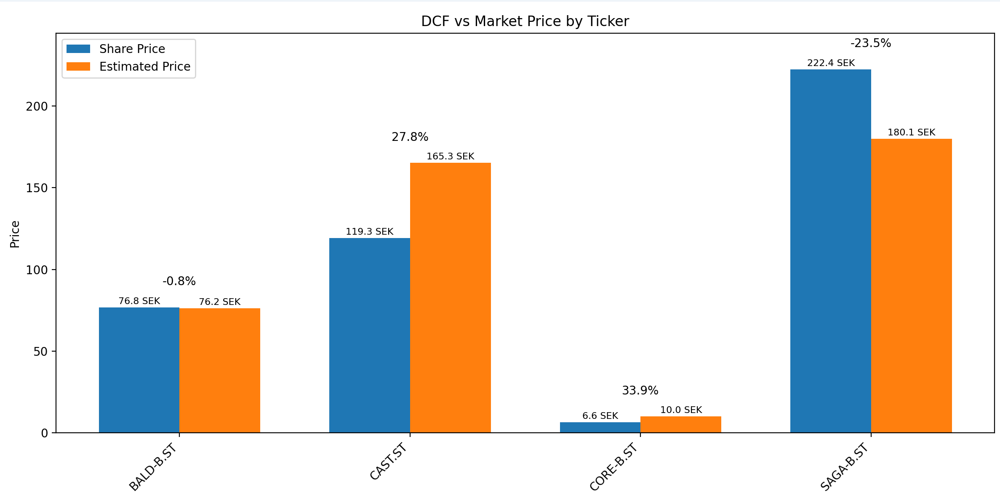

# DCF
A simple DCF model created with Python and SQL. 

Intended for learning and not practical use. It serves as a beginner-friendly project to gain 
hands-on experience with building financial models.
It does not delve deep into financial theory or advanced DCF forecasts.


## Installation
Install the required Python libraries by running:

```bash
py -m pip install -r requirements.txt
```

## Current Status:
This program is currently in development. The following features are implemented:
- [x] Basic DCF model
- [x] SQL database for storing data
- [x] Basic output of DCF results
- [x] Documentation and comments

- [ ] User interface for inputting data
- [ ] More advanced DCF calculations
- [ ] Error handling and validation
- [ ] Unit tests
- [ ] Deployment instructions

## Running the Program
Go into the config.py and enter the tickers you want to analyze, i.e.
```bash
TICKERS = ['BALD-B.ST', 'CORE-B.ST', 'SAGA-B.ST', 'CAST.ST'].
```
Optional to tweak the different parameters here too.

Run main.py and a chart will be plotted with the estimated share price, market share price and the margin of safety:




## Calculations / Methodology
The DCF model is based on the following formula for calculating the estimated value of a company:

$$
    Value = \sum_{t=1}^{n} \frac{FCF_t}{(1 + r)^t} + \frac{TV}{(1 + r)^n}
$$
   
Where: 
- $FCF_t$ is the free cash flow in year $t$
- $r$ is the discount rate, WACC (Weighted Cost of Capital)
- $n$ is the last year of the time interval
- $TV$ is the terminal value.

Essentially what this formula is doing is estimating the value of a company by 
summing the present value of estimated future cash flows plus the value beyond the forecast period. 

#### Free Cash Flow: $FCF_t$
The estimation of $FCF_t$ for this model is simple. A $5$% annual growth is used with the last yearly report free cash flow as base. 
Here major improvements can be done with a more accurate estimation of annual growth. An indivudal growth estimate per company by looking at previous
cash flows would be better.

#### Discount Rate: $r$ 
WACC is used as the discount rate ($r$). The following formula is used:

$$
WACC = \left( r_{debt} \times (1 - TaxRate) \times \frac{Debt}{Equity + Debt} \right) + \left( r_{equity} \times \frac{Equity}{Equity + Debt} \right)
$$

Where:  
- $r_{debt}$ is the cost of debt  
- $r_{equity}$ is the cost of equity  
- $Debt$ is the total debt  
- $Equity$ is the total equity  
- $TaxRate$ is the corporate tax rate.

The model also sets a WACC floor of $8$% to prevent overvaluation of companies. 
If data to calculate WACC is missing the model will default to a $10$% discount rate.
Worth noting here is that the $r_{equity}$ is calculated using the CAPM (Capital Asset Pricing Model)

$$
    r_{equity} = r_f + \beta * (r_m-r_f)
$$

Where:
- $r_f$ is the risk free rate (assumed to be $2.5$%)
- $\beta$ is the beta of the stock (measure of the companies volatility relative to the stock market)
- $r_m$ is the expected market return (based on historic performance of the swedish market - assumed to be $8$%) 

#### Time Horizon: $n$
For simplicity this model sets a time horizon of five years. Research has not been done on how many years is optimal for
a DCF.

#### Terminal Value $TV$
The terminal value ($TV$) estimates the value of a company beyond the forecast period ($n$). It assumes a steady growth rate for 
cash flow for an indefinite amount of time. In the DCF formula it is then discounted back to present value.
$TV$ is calculated using the perpetuity formula (also called the Gordon Growth method): 

$$
    TV = \frac{FCF_n \times (1 + g)}{r - g} 
$$

Where:
- $FCF_n$ is the free cash flow for year $n$
- $g$ is the terminal growth rate i.e. growth rate for the company as it is assumed to generate cash flows for forever 
(assumed to be $2$%)
- $r$ is the discount rate i.e. WACC.
